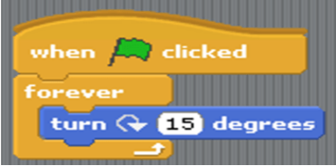

# Assignment 1 Quiz

1) Which of the following is true about a program?

- [ ] A program is a set of instructions
- [ ] A program performs a specific task
- [ ] A program is an executable file
- [x] All of the above

2) State True or False.

A program can be written in simple english language

- [ ] True
- [x] False

3) Which of the following is a programming language?

- [ ] BASIC
- [ ] FORTRAN
- [ ] LOGO
- [x] All the above

4) State True or False.

   Programming languages are used to give instructions to computers.

   - [x] True
   - [ ] False

5) Which of the following can be used to communicate across multiple sprites?

  - [x] broadcast messages
  - [ ] wait option
  - [ ] sounds options
  - [ ] join operator

6) 

Which of the following is an output of the above set of
instructions?

  - [ ] A jumping sprite
  - [x] A rotating sprite
  - [ ] A stationary sprite
  - [ ] A sleeping sprite

7) What kind of block should i use to make my sprite move around?

  - [ ] Sensing
  - [ ] Sound
  - [x] Motion
  - [ ] None of the above

8) Which of the following is a facility provided by Scratch to use sound effects?

  - [ ] A sound library is provided
  - [ ] We can record sound using a microphone
  - [ ] We can use a sound file
  - [x] All the above

9) What happens when the green flag symbol is clicked in Scratch?

- [x]  The program starts
- [ ]  The program gets deleted
- [ ]  The program halts
- [ ]  Nothing happens
