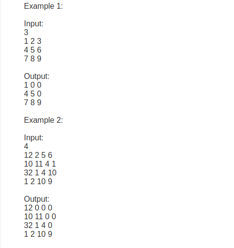
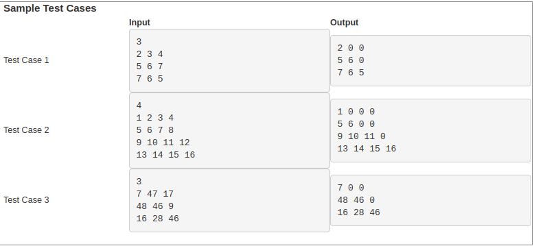

# Week Seven - Programming Assignment-1: Lower Triangular Matrix
A Lower triangular matrix is a square matrix (where the number of rows and columns are equal)  where all the elements above the diagonal are zero.
For example, the following is an upper triangular matrix with the number of rows and columns equal to 3.

| OUTPUT |
| ------ |
| 1 0 0  |
| 4 5 0  |
| 7 8 9  |

Write a program to convert a square matrix into a lower triangular matrix.

# Input Format:
The first line of the input contains an integer number n which represents the number of rows and the number of columns.
From the second line, take n lines input with each line containing n integer elements. Elements are separated by space.

# Output format:
Print the elements of the matrix with each row in a new line and each element separated by a space.

# Examples

# Explanation:
In both the examples, elements which are above the diagonal are zero.

NOTE: There should not be any extra space after the elements of the last column and no extra newline after the last row of the matrix.

# Test Cases

