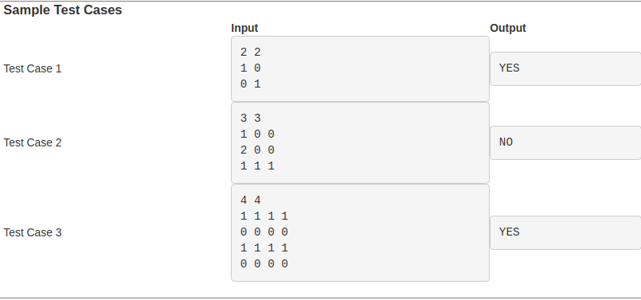

# Week 7 - Programming Assignment 3 - Check if Binary Matrix

Given a matrix with N rows and M columns, the task is to check if the matrix is a Binary Matrix. A binary matrix is a matrix in which all the elements are either 0 or 1.

# Input Format:
The first line of the input contains two integer number N and M which represents the number of rows and the number of columns respectively, separated by a space.
From the second line, take N lines input with each line containing M integer elements with each element separated by a space.

# Output Format:
Print 'YES' or 'NO' accordingly

# Example:

| MATRIX |
| ------ |
| 1 0 0  |
| 0 0 1  |
| 1 1 0  |

OUTPUT :
YES

# Test Cases

