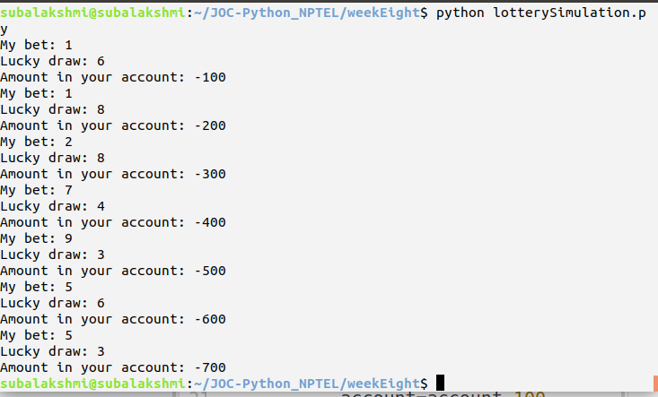
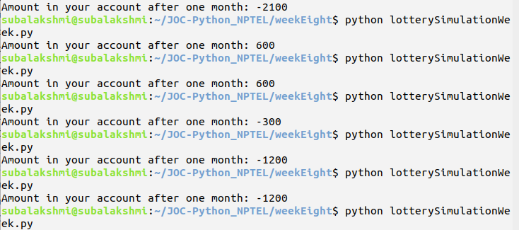
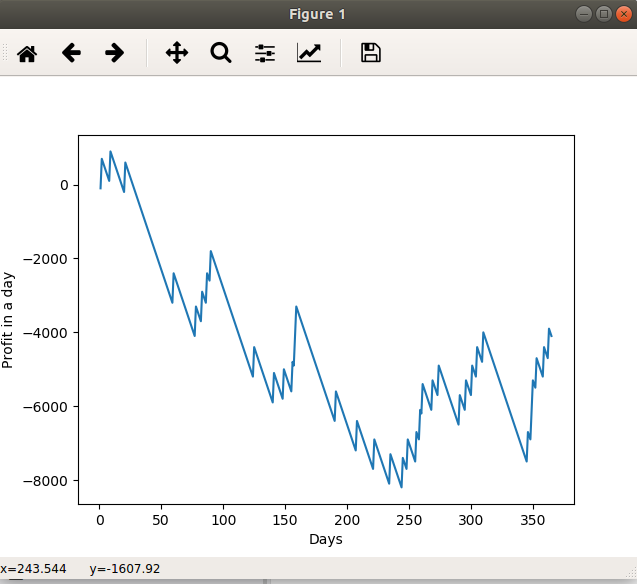

# Lottery Simulation - Profit or Loss

Gamblers rule in probability theory.

-- Coupons  - available

Bet on one Coupon

Randomly picked Coupons - matches the selected Coupon - WIN

-------- Random --------

```python3
import random
```

--- Lottery Simulation Outcome ---



--- Lottery simulation for a week ---



--- Lottery simulation for a year ---

